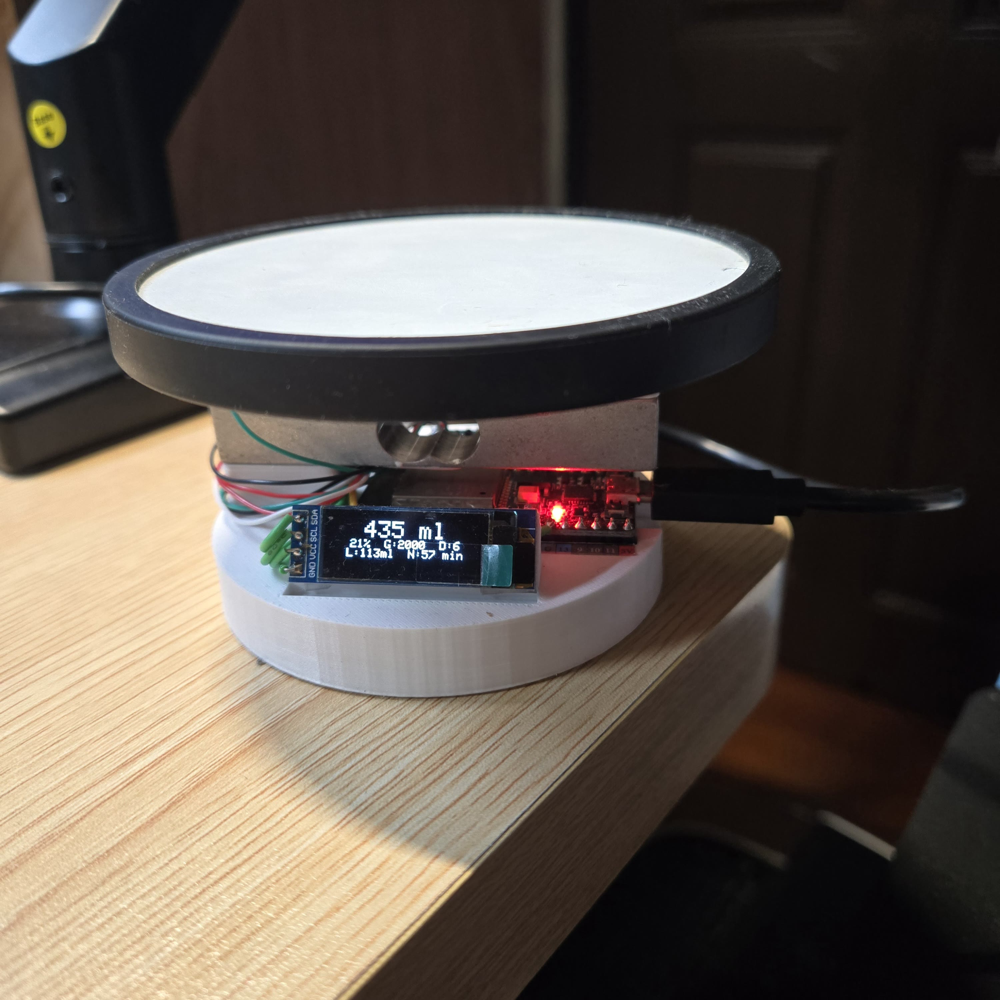

# HydraCup

[](https://platformio.org)
[](https://www.espressif.com/en/products/socs/esp32)
[](https://www.arduino.cc)
[](include/version.h)
[](https://github.com/Ning0612/esp32-hydracup/actions/workflows/ci.yml)
[](LICENSE)

ESP32-based smart water cup tracker. Measures cup weight via HX711, detects drink events, sends Discord Webhook notifications, and provides a local web dashboard.

## Project Status

Personal side project for daily hydration tracking. It may continue to receive maintenance when new feature ideas or practical usage needs come up.

<p align="center">
  
</p>

## Demo

<p align="center">
  
</p>

The GIF above is a compressed full-length preview; use the MP4 link below for the full-quality demo.

Full demo video:

- [Drink detection demo (MP4)](docs/demo/drink-detection-demo.mp4)

OLED status:

<p align="center">
  
</p>

---

## Features

- **Automatic drink detection** — 6-state machine triggered only via cup-lift path, avoids false positives
- **Web dashboard** — real-time weight, daily progress, and drink history at `http://<device-ip>`
- **Discord Webhook** — online notification, per-drink notification, daily summary at midnight
- **JSONL event log** — monthly log files stored on a dedicated LittleFS partition (`/logs/`)
- **OLED display** — 2-page rotating status display with auto-sleep
- **Configurable reminders** — interval-based buzzer reminder when no drink detected
- **Captive config portal** — WiFi setup at `192.168.4.1` on first boot (no app needed)
- **Non-blocking design** — all timing via `millis()`; no `delay()` in main loop

---

## Hardware Requirements

| Component | Spec | GPIO |
|-----------|------|------|
| ESP32 dev board | 30-pin or 38-pin | — |
| HX711 load cell amplifier | 10 Hz or 80 Hz | DOUT→4, SCK→5 |
| Load cell / strain gauge | 1–5 kg range | via HX711 |
| SSD1306 OLED | 128×32, I2C | SDA→21, SCL→22 |
| Passive buzzer | 3.3 V compatible | PWM→18 |

See [docs/hardware.md](docs/hardware.md) for wiring details and BOM.

---

## Quick Start

**Prerequisites**: [PlatformIO](https://platformio.org/install/cli), Python 3.x, CP210x / CH340 USB driver

```bash
# 1. Clone
git clone https://github.com/<your-user>/esp32-hydracup.git
cd esp32-hydracup

# 2. Build firmware
pio run

# 3. Flash firmware + web assets (first time)
pio run --target upload
pio run --target uploadfs

# 4. Power on — device broadcasts "WaterCupTracker-Setup" AP
#    Connect to it and open http://192.168.4.1
#    Enter your WiFi credentials and save

# 5. After reboot, find the device IP and open http://<ip>
```

See [docs/guides/getting-started.md](docs/guides/getting-started.md) for the complete first-time setup walkthrough.

---

## Architecture Overview

```
┌─────────────────── Normal Mode ──────────────────────┐
│  ScaleManager (HX711 + moving avg)                   │
│       │                                              │
│  DrinkDetector (6-state machine)                     │
│       ├─→ EventLogger  (JSONL /logs/)                │
│       ├─→ DiscordNotifier  (async HTTPS Webhook)     │
│       ├─→ ReminderManager  (millis interval)         │
│       ├─→ BuzzerController (LEDC PWM queue)          │
│       └─→ AppState  (shared runtime state)           │
│                                                      │
│  DashboardServer  (HTTP API + static assets)         │
│  DisplayManager   (SSD1306 OLED pages)               │
│  TimeManager      (NTP sync)                         │
│  DailySummaryManager (midnight Discord summary)      │
└──────────────────────────────────────────────────────┘

┌────── AP Mode (no WiFi configured) ──────────────────┐
│  ConfigPortal  (HTTP at 192.168.4.1)                 │
└──────────────────────────────────────────────────────┘
```

---

## API Quick Reference

| Method | Path | Description |
|--------|------|-------------|
| GET | `/api/status` | Full system state snapshot |
| GET | `/api/weight` | Current weight + cup state |
| GET | `/api/config` | All settings |
| POST | `/api/config` | Update settings |
| POST | `/api/tare` | Tare scale |
| POST | `/api/calibrate` | Calibrate with known weight |
| GET | `/api/logs?month=YYYY-MM` | Drink history |
| GET | `/api/wifi/scan` | Scan nearby networks |
| POST | `/api/reboot` | Reboot device |

All responses: `{"ok": true, ...}` or `{"ok": false, "error": "..."}`.  
Full API reference: [docs/api.md](docs/api.md)

---

## Documentation

| Document | Description |
|----------|-------------|
| [docs/hardware.md](docs/hardware.md) | GPIO wiring and bill of materials |
| [docs/architecture.md](docs/architecture.md) | System architecture, boot flow, drink detection state machine |
| [docs/api.md](docs/api.md) | Complete REST API reference |
| [docs/modules.md](docs/modules.md) | Firmware module descriptions and public APIs |
| [docs/data-formats.md](docs/data-formats.md) | JSONL log format and NVS storage schema |
| [docs/guides/getting-started.md](docs/guides/getting-started.md) | First-time setup |
| [docs/guides/build-flash.md](docs/guides/build-flash.md) | Build and flash commands |
| [docs/guides/calibration.md](docs/guides/calibration.md) | Scale calibration |
| [docs/guides/configuration.md](docs/guides/configuration.md) | All settings explained |
| [docs/guides/discord-setup.md](docs/guides/discord-setup.md) | Discord Webhook setup |

## License

This public version is released under the MIT License. See [LICENSE](LICENSE).
